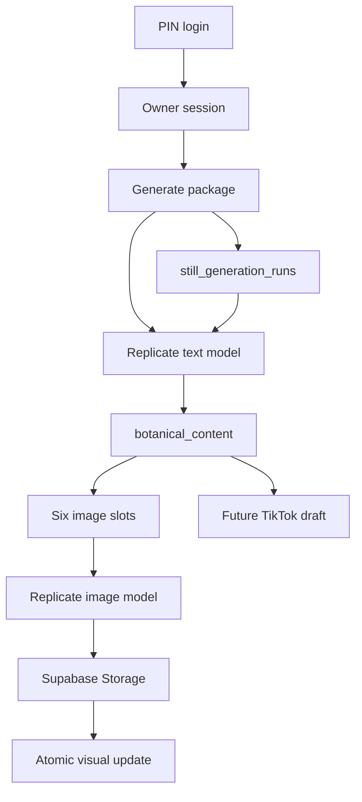
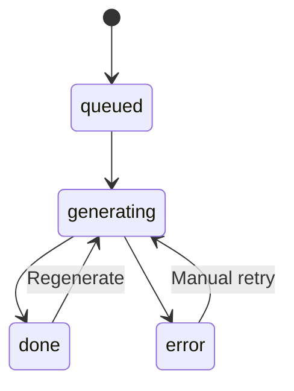

# Botanical Generator Schema Map

This document covers the live generator, its six images, the caption package, and the future TikTok handoff. It intentionally excludes the unused experimental panels from the active workflow.

## Live data flow

## Generator tables and storage

| Resource | Purpose | Key links |
|---|---|---|
| `botanical_content` | One complete content package | Primary key `id`; owns script, caption, thumbnail prompt, Part 2 hook, and six visual slots |
| `still_generation_runs` | One cost-confirmed six-image package attempt | `idempotency_key` prevents duplicate packages; `botanical_content_id` links the completed package; one active row per owner |
| `cost_events` | Provider submission and cost ledger | `generation_run_id` identifies package jobs; regeneration operations include an idempotency key |
| `app_members` | Authorizes the private owner session | `user_id` links to `auth.users.id` |
| `app_auth_settings` | Stores the hashed PIN | Singleton row; never stores the readable PIN |
| `app_secrets` | Stores encrypted private API credentials | `REPLICATE_API_KEY` is encrypted with AES-GCM |
| `storage.objects` | Stores permanent generated images | Bucket `botanical-faceless-visuals`; object paths begin with the `botanical_content.id` |
| `content_publications` | Future publishing record | `botanical_content_id` links a package to a TikTok delivery |
| `tiktok_send_jobs` | Future TikTok delivery status | `publication_id` links to `content_publications.id` |
| `tiktok_tokens` | Future TikTok account connection | Encrypted account tokens will be used by the TikTok publishing functions |

## `botanical_content` field map

| Field | Stored value | Used by |
|---|---|---|
| `id` | UUID created before image generation | History, storage paths, retries, publishing |
| `generation_run_id` | Package-level spending and idempotency record | Active-run lock, cost ledger, model and prompt versions |
| `plant_name` | Scientific and common name | Header and every image prompt |
| `verified_fact` | Core factual premise | Script and package summary |
| `script` | Structured JSON string | Hook, Dangle 1, Re-hook, Dangle 2, Payoff, Verified Truth, Close |
| `thumbnail` | Mode and thumbnail prompt JSON | Thumbnail production |
| `caption` | Long-form social caption | Copy and future TikTok draft |
| `part2_hook` | Follow-up content hook | Continuation post |
| `script_visuals` | Ordered JSON array of six image slots | Image status, prompt, permanent URL, errors, versions, timing, prediction ID |
| `created_at` | Package creation time | Ten-record history ordering |
| `queue_status` | Package-level workflow marker | Reserved for future publishing workflow |

## Script to image mapping

| Position | Visual moment | Script relationship | Visual purpose |
|---:|---|---|---|
| 1 | `hook` | `script.hook` | Hero subject and immediate stop power |
| 2 | `dangle_1` | `script.dangle_1` | Extreme detail that withholds context |
| 3 | `rehook` | `script.rehook` | High-energy diagonal reset |
| 4 | `dangle_2` | `script.dangle_2` | Technical dissection or internal anatomy |
| 5 | `verified_truth` | `script.verified_truth` | Structured evidence board |
| 6 | `close` | `script.close` | Minimal resolved archive plate |

`script.payoff` remains part of the spoken script but does not create a seventh image. This keeps the TikTok carousel at six intentional frames.

## Visual slot schema

Each object inside `script_visuals` uses these fields:

| Field | Meaning |
|---|---|
| `moment` | One of the six fixed visual moments |
| `prompt` | Complete Replicate-ready 9:16 prompt |
| `status` | `queued`, `generating`, `done`, or `error` |
| `started_at` | Start time for stale-job detection |
| `completed_at` | Success or failure completion time |
| `prediction_id` | Replicate prediction identifier when available |
| `provider` | `replicate` or the optional Replicate-hosted OpenAI image model |
| `model` | Exact Replicate model identifier selected for the slot |
| `model_version` | Version returned when Replicate accepts the prediction |
| `prompt_version` | Immutable version of the botanical study-plate prompt contract |
| `settings` | Aspect ratio, quality, format, safety, and prompt-upsample settings |
| `seed` | Reproducibility seed when supported; otherwise `null` |
| `image_url` | Permanent Supabase Storage URL |
| `error` | Retryable failure reason |
| `history` | Up to five prior image versions with prompt, provider, model, settings, version, seed, and timestamp |

## Reliability rules

- Visual updates use `patch_botanical_visual`, which locks the parent row and changes only one moment. Concurrent image completions cannot overwrite sibling images.
- A missing image that remains `generating` for ten minutes is treated as interrupted and becomes retryable.
- A permanent image URL is authoritative. If a migrated status is incorrect but an image exists, the slot is normalized to `done`.
- Replicate retries are bounded. The UI never presents an abandoned historical job as active.
- The history query is capped at the ten most recent retained packages.
- Direct still generation requires a fresh server quote and confirmation before any Replicate request.
- A database claim allows only one active six-image package per owner and makes every request idempotent.
- The current hard ceilings are $1 per package and $5 per Central Time calendar day.
- Daily accounting is conservative: an unknown provider outcome reserves its estimate instead of assuming a zero charge.
- Every package records the model, returned model version, prompt version, pricing version, and seven cost events: one text request plus six image slots.
- Standard regeneration reuses the slot's exact saved prompt, recorded model, and recorded settings. Browser state cannot change them.
- `Refresh prompt` is the explicit opt-in path for rebuilding a slot with the latest locked prompt contract.
- Regeneration requires its own server quote and confirmation, appears in the cost ledger, and preserves the replaced image plus all generation metadata in history.
- Stuck-image recovery also resolves the model and settings from each saved slot before resuming or retrying it.

## Future TikTok link

The generator package is already addressable by `botanical_content.id`. The TikTok phase should create one `content_publications` row for that ID, then one `tiktok_send_jobs` row for delivery status. No image or caption data needs to be duplicated.
